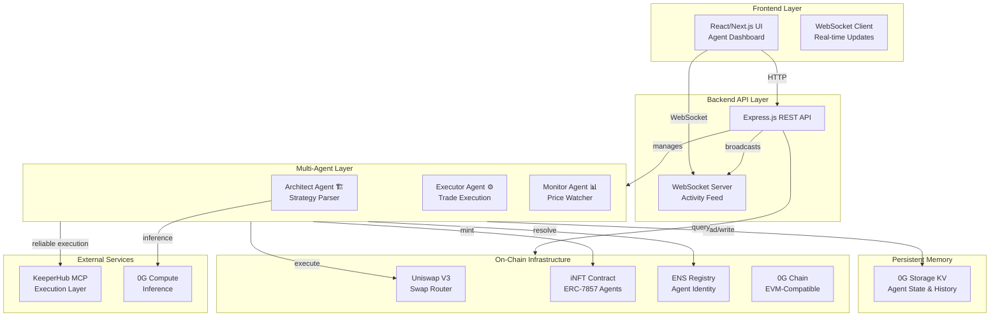
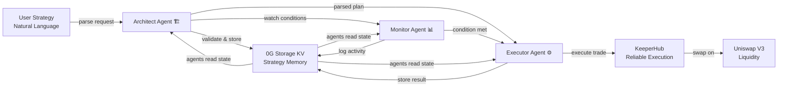
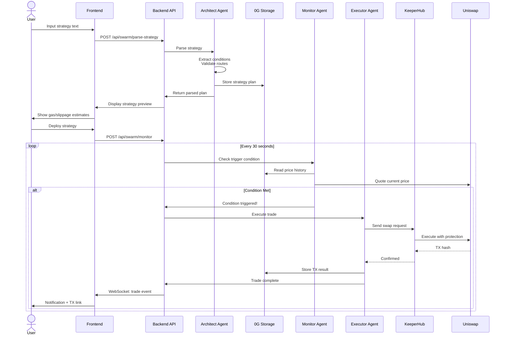
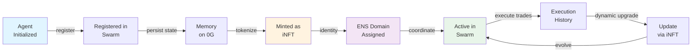
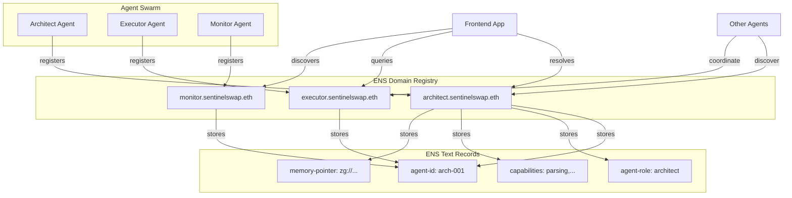
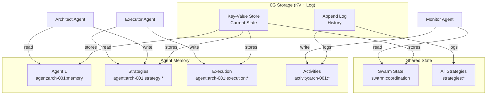
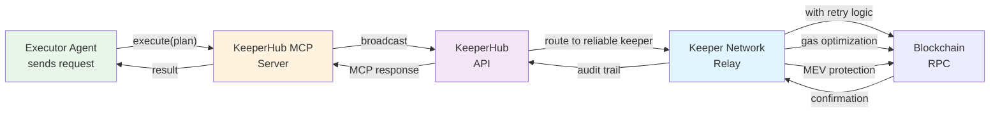
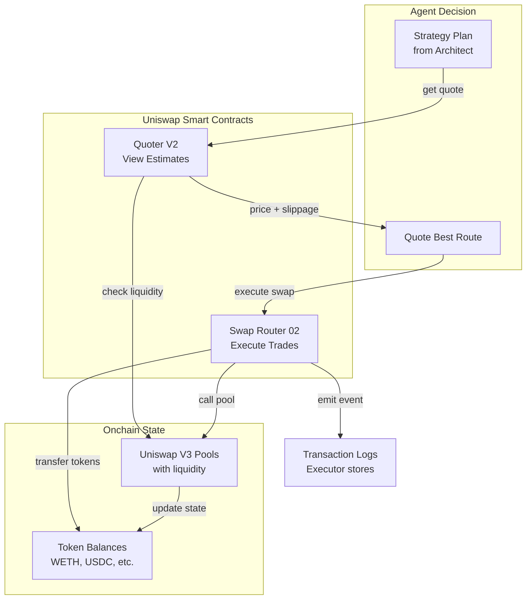

# Sentinel Architecture & Design Docs

## System Architecture Diagrams

### 1. High-Level System Architecture



### 2. Multi-Agent Swarm Coordination



### 3. Data Flow: Strategy to Execution



### 4. Agent Lifecycle & iNFT Tokenization



### 5. ENS Agent Discovery Network



### 6. 0G Storage: Persistent Memory Architecture



### 7. KeeperHub Integration: Reliable Execution



### 8. Uniswap V3 Integration Path



---

## Agent State Management

### Agent State Schema

```typescript
interface AgentMemory {
  agentId: string;
  role: 'architect' | 'executor' | 'monitor';
  
  // Persistent state
  strategies: Map<strategyId, StrategyPlan>;
  executionHistory: Execution[];
  coordinationState: SwarmState;
  
  // Metadata
  createdAt: number;
  lastUpdated: number;
  metadata: AgentMetadata;
}

interface StrategyPlan {
  id: string;
  parsed: ParsedIntent;
  route: Route[];
  gasEstimate: string;
  priceImpact: string;
  validated: boolean;
  validatedBy: string; // architect agent id
}

interface Execution {
  txHash: string;
  strategyId: string;
  result: TradeResult;
  timestamp: number;
  executor: string; // executor agent id
}
```

---

## Communication Protocol

### Agent-to-Agent Communication

**Via 0G Storage (async):**
- Architect writes strategy → Executor reads strategy
- Executor writes execution result → Monitor reads result
- Monitor logs condition → Architect reads for next iteration

**Via WebSocket (real-time):**
- Backend broadcasts execution events to frontend
- Frontend updates UI in real-time
- Swarm coordination state published every 30 seconds

---

## Security Model

### On-Chain Safety
- ✅ Smart contract audited patterns (Uniswap)
- ✅ Slippage protection enforced
- ✅ MEV protection via KeeperHub
- ✅ Non-custodial: agents don't hold funds

### Off-Chain Security
- ✅ Strategy encrypted in 0G Storage
- ✅ iNFT access control via ownership
- ✅ ENS text records immutable by default
- ✅ WebSocket auth via session token

---

## Scalability Considerations

### Current Limits
- Single Ethereum chain (Sepolia)
- Sequential agent execution
- SQLite for local data

### Scaling Path
1. **Phase 2:** Multi-chain via layered agents
2. **Phase 3:** Parallel agent execution within swarm
3. **Phase 4:** Cross-chain strategy atomicity
4. **Phase 5:** Horizontal scaling via keeper network

---

## Testing Strategy

### Unit Tests
- Agent decision logic
- Route validation
- State management

### Integration Tests
- Architect → Executor flow
- Monitor trigger detection
- 0G Storage persistence

### End-to-End Tests
- Full strategy deployment
- Trade execution on Sepolia
- WebSocket real-time updates

### Performance Tests
- Agent response time < 1s
- WebSocket latency < 100ms
- 0G Storage read/write throughput

---

## Deployment Architecture

### Development
```
localhost:3000 (Next.js)
localhost:3001 (Express API)
localhost:3002 (KeeperHub MCP)
./sentinelswap.db (SQLite)
```

### Production (0G Chain)
```
Frontend: IPFS/Fleek
Backend: 0G Compute Container
Storage: 0G Storage Network
Chain: 0G EVM Layer
```

---

*Last Updated: May 2026*
